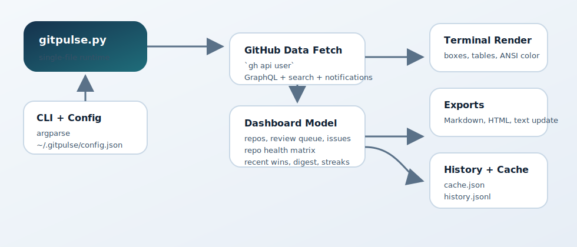

# GitPulse

> A polished single-file terminal dashboard for GitHub activity, powered by `gh`.

[](https://www.python.org/)
[](#)
[](https://cli.github.com/)
[](#license)

GitPulse turns your authenticated GitHub CLI session into a fast terminal snapshot of what matters right now: active repos, review queue, assigned issues, contribution streaks, repo health, and recent shipped work. It stays dependency-free, renders with plain `print()` output, and keeps the runtime in a single `gitpulse.py` file.

## ✨ Features

- Beautiful terminal dashboard with ANSI color, boxes, tables, and zero third-party packages
- Repos sorted by recent activity
- Open PRs waiting on you
- Failing or merge-ready authored PRs
- Issues assigned to you
- Contribution heatmap, streaks, and recent-change detection
- `Recent Wins` section for merged PRs and closed issues from the last 7 days
- `Repo Health Matrix` across the top repos in scope, plus detailed drilldown with `--repo`
- Focus modes for `--reviews`, `--failing`, `--stale`, `--inbox`, `--repo`, and `--org`
- Watch mode with deltas between refreshes
- Markdown, HTML, and plain-text standup exports
- Config file and named profiles from `~/.gitpulse/config.json`

## 🚀 Quick Start

### Requirements

- Python 3.10+
- GitHub CLI installed and authenticated

```bash
gh auth status
python3 gitpulse.py
```

### Installation

```bash
git clone <your-fork-or-repo-url>
cd test-spec
python3 gitpulse.py --help
```

### Common Usage

```bash
python3 gitpulse.py
python3 gitpulse.py --limit 8 --digest daily
python3 gitpulse.py --reviews
python3 gitpulse.py --failing --repo owner/repo
python3 gitpulse.py --stale --org my-org
python3 gitpulse.py --watch --interval 30
python3 gitpulse.py --export-md standup.md --export-html standup.html
python3 gitpulse.py --export-update update.txt --standup
python3 gitpulse.py --profile work
python3 gitpulse.py --config ./gitpulse.json --profile release
```

## 🖥️ Dashboard Overview

GitPulse keeps the default experience simple:

```bash
python3 gitpulse.py
```

That single command renders:

- Daily brief
- Recent wins
- Attention radar
- Optional digest section
- Contribution heatmap and streaks
- Repo health matrix
- Active repos
- Review queue
- Failing or ready authored PRs
- Assigned issues
- Detailed repo health drilldown when `--repo owner/name` is used

## ⚙️ Configuration And Profiles

GitPulse reads config from `~/.gitpulse/config.json` by default. Override it with `--config PATH` or select a named preset with `--profile NAME`.

Precedence is:

1. Explicit CLI flags
2. Selected profile values
3. Top-level config defaults
4. Built-in defaults

### Example Config

```json
{
  "defaults": {
    "limit": 8,
    "digest": "daily",
    "export_md": "standup.md"
  },
  "profiles": {
    "work": {
      "org": "acme",
      "reviews": true,
      "watch": true,
      "interval": 45
    },
    "release": {
      "repo": "acme/platform",
      "failing": true,
      "digest": "weekly",
      "export_html": "release.html"
    }
  }
}
```

### Profile Examples

```bash
python3 gitpulse.py --profile work
python3 gitpulse.py --profile release --limit 4
python3 gitpulse.py --config ./ops.json --profile triage
```

## 📤 Exports

GitPulse can export the same fetched snapshot in three formats without doing a second fetch.

```bash
python3 gitpulse.py --export-md standup.md
python3 gitpulse.py --export-html standup.html
python3 gitpulse.py --export-update update.txt
```

Exports include the new repo health and recent wins data where it fits naturally.

## 🧭 Flags

| Flag | Description |
| --- | --- |
| `--config PATH` | Override the config file path |
| `--profile NAME` | Use a named profile from config |
| `--limit N` | Rows to show per section |
| `--width auto\|full` | Clamp layout for readability or use full terminal width |
| `--refresh` | Ignore the previous disk cache snapshot, then write a new one |
| `--no-cache` | Disable cache reads and writes for this run |
| `--watch` | Refresh continuously |
| `--interval SECONDS` | Watch refresh interval |
| `--iterations N` | Stop watch mode after `N` iterations |
| `--export-md PATH` | Write a Markdown export |
| `--export-html PATH` | Write a self-contained HTML export |
| `--export-update PATH` | Write a compact plain-text team update |
| `--reviews` | Focus on review-requested PRs |
| `--failing` | Focus on authored PRs with failing checks |
| `--stale` | Focus on work stale for 3+ days |
| `--inbox` | Focus on unread mentions, assignments, and review requests |
| `--digest daily\|weekly` | Add a digest section |
| `--standup` | Print the compact team update to stdout |
| `--repo OWNER/NAME` | Filter to one repository and show detailed repo health |
| `--org ORGNAME` | Filter to repositories owned by one org |

## 🧱 Architecture

Runtime stays in one file: [`gitpulse.py`](gitpulse.py). The main data flow is:



## 📸 Screenshot

Terminal screenshot placeholder:

```text
[ Add an updated terminal capture of `python3 gitpulse.py` here ]
```

## 🛠️ Development Notes

- Stdlib only
- No curses
- No external Python packages
- Uses authenticated `gh` CLI calls for GitHub data
- Caches snapshots in `~/.gitpulse/cache.json`
- Appends historical snapshots to `~/.gitpulse/history.jsonl`

## 📄 License

No license file is included in this repository yet.
